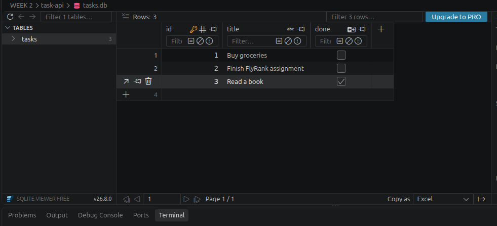

# Task API (Database Edition)

This is a simple CRUD API for a to-do list, built with **Python and FastAPI**.
In this version, we upgraded the storage layer from an in-memory array to a persistent SQL database using **SQLite** and **SQLModel**.

## Why SQLite?
We chose SQLite because it is a lightweight, serverless relational database. It requires no installation or background services; the entire database is stored in a single file on disk, making it perfect for small applications.

## Where is the data stored?
All tasks are persisted in a local database file named `tasks.db`. If the file does not exist, the API will automatically create it.

## How to Install & Run
1. Install requirements: `pip install "fastapi[standard]" sqlmodel`
2. Run server: `fastapi dev main.py`
3. Visit `http://localhost:8000/docs` to test the API.

## Example SQL Query
```sql
SELECT * FROM tasks WHERE done = 1;
```

## Database Screenshot
