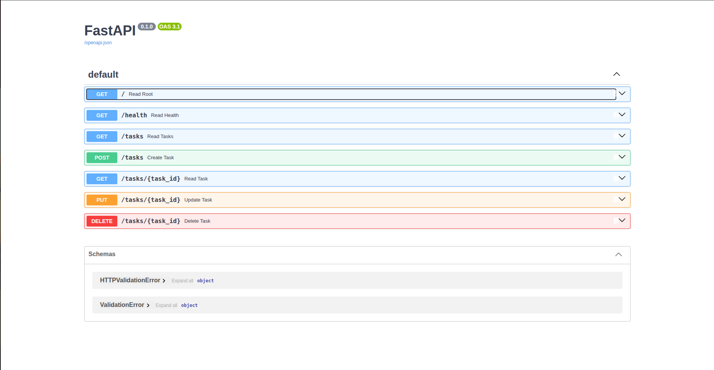

# Task API

This is a simple, in-memory CRUD (Create, Read, Update, Delete) API for a to-do list, built with **Python and FastAPI**. It was built in stages for the FlyRank AI Internship (Backend AI Engineering track).

## How to Install & Run

1. Make sure you have Python 3.10+ installed.
2. Install the required packages:
   ```bash
   pip install fastapi uvicorn
   ```
3. Start the server (this is the single documented command to run it):
   ```bash
   uvicorn main:app --reload
   ```
4. Visit `http://localhost:8000/docs` in your browser to see the interactive Swagger UI!

## Endpoints

| CRUD Operation | HTTP Method | Endpoint | Meaning |
|---|---|---|---|
| Read (Meta) | GET | `/` | API Metadata |
| Read (Health) | GET | `/health` | Server Health Check |
| Read (All) | GET | `/tasks` | List all tasks |
| Read (One) | GET | `/tasks/{id}` | Get a specific task by ID |
| Create | POST | `/tasks` | Add a new task (requires title) |
| Update | PUT | `/tasks/{id}` | Update task title or done status |
| Delete | DELETE| `/tasks/{id}` | Remove a task |

## Example curl Output

Testing the `GET /tasks/1` endpoint:

```bash
$ curl -i http://localhost:8000/tasks/1
HTTP/1.1 200 OK
date: Thu, 10 Sep 2026 14:48:19 GMT
server: uvicorn
content-length: 45
content-type: application/json

{"id":1,"title":"Buy groceries","done":false}
```

## Swagger UI Screenshot



*(Make sure to run the server, go to http://localhost:8000/docs, take a screenshot, and save it here as `swagger-screenshot.png` before pushing to GitHub!)*
