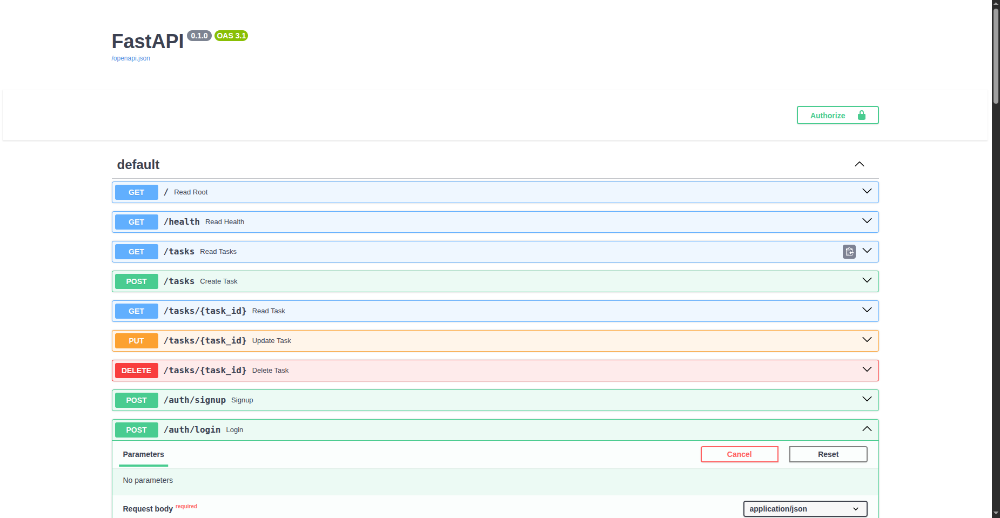

# Secure Task API 🔒

This project is a fully functional Task Management API built with FastAPI. It uses **Supabase** as an Identity Provider to handle secure user authentication, issuing and verifying JSON Web Tokens (JWTs) via middleware to protect private endpoints.

##  How to Run Locally

1. **Set up Environment Variables:**
   Create a `.env` file in the root directory and add your Supabase credentials:
   ```env
   DATABASE_URL="sqlite:///tasks.db"
   SUPABASE_URL="https://your-project-url.supabase.co"
   SUPABASE_KEY="your-anon-publishable-key"
   ```
   *(Note: Never commit this file to GitHub!)*

2. **Install Dependencies:**
   ```bash
   pip install -r requirements.txt
   ```

3. **Run the Server:**
   ```bash
   fastapi dev main.py
   ```
   Visit `http://localhost:8000/docs` to interact with the API!

##  API Reference

| Method | Endpoint | Purpose | Auth Required? |
|--------|----------|---------|----------------|
| `GET` | `/public/info` | View public info | ❌ No |
| `POST` | `/auth/signup` | Create a new account | ❌ No |
| `POST` | `/auth/login` | Log in and get JWT token | ❌ No |
| `GET` | `/protected/profile`| View private user data | 🔒 Yes (Bearer Token) |
| `POST` | `/auth/logout` | Destroy session | 🔒 Yes (Bearer Token) |

##  Security Documentation
